# 🐾 Pet Adoption & Rescue Platform

A Django-based **Pet Adoption & Rescue Platform** where users can browse
available pets, search and filter pets, submit adoption applications,
and track their requests. Administrators can manage pets and adoption
requests through Django Admin.

The project includes both:

-   🌐 **Django Template-based Web Application**
-   🔌 **REST API using Django REST Framework (DRF)**

------------------------------------------------------------------------

## 📌 Project Overview

The Pet Adoption & Rescue Platform is designed to simplify the process
of finding pets and applying for adoption.

Users can:

-   Register and log in
-   Browse available pets
-   Search and filter pets
-   View detailed pet information
-   Apply for adoption
-   View their adoption requests
-   Track application status
-   Manage favorite pets *(optional/bonus feature if enabled)*

Administrators can:

-   Add, edit, and delete pets
-   Upload pet images
-   Change pet adoption status
-   Review adoption requests
-   Approve or reject applications

------------------------------------------------------------------------

## ✨ Features

### 👤 User Authentication

-   User registration
-   User login
-   User logout
-   User profile
-   Protected adoption functionality

### 🐕 Pet Management

Each pet contains:

-   Pet name
-   Animal type
-   Breed
-   Age
-   Gender
-   Location
-   Description
-   Pet image
-   Adoption status
-   Created date

### 🔍 Search & Filtering

Users can search/filter pets by:

-   Pet name
-   Animal type
-   Breed
-   Gender
-   Location
-   Adoption status

Example:

``` text
Search: Golden
Animal Type: Dog
Gender: Male
Location: Dhaka
```

### 🐾 Pet Details

A dedicated details page displays:

-   Pet image
-   Name
-   Animal type
-   Breed
-   Age
-   Gender
-   Location
-   Description
-   Adoption status
-   Adoption button when the pet is available

If a pet has already been adopted, users cannot submit a new
application.

### 📝 Adoption Requests

Logged-in users can submit an adoption application containing:

-   Address
-   Phone number
-   Reason for adoption
-   Previous pet experience
-   Additional message

### 📋 User Dashboard

Users can view their adoption requests and their current status:

-   Pending
-   Approved
-   Rejected

### 🔧 Django Admin

Django Admin is used to manage the complete system.

Administrators can manage:

-   Pets
-   Pet images
-   Adoption requests
-   Adoption status
-   Application status

------------------------------------------------------------------------

## 🧠 Business Rules

The application implements the following important rules:

### Rule 1 --- Only Available Pets Can Be Adopted

Users cannot submit an adoption request for a pet whose status is
already **Adopted**.

### Rule 2 --- Prevent Duplicate Active Requests

A user cannot submit multiple active adoption requests for the same pet.

For example:

``` text
User: Rahim
Pet: Max
Status: Pending

→ Another Pending request for Max is not allowed.
```

### Rule 3 --- Approval Changes Pet Status

When an administrator approves an adoption request:

``` text
Adoption Request
       ↓
   Approved
       ↓
Pet Status = Adopted
```

Once the pet is adopted, new adoption applications are prevented.

------------------------------------------------------------------------

# 🌐 REST API

The project provides REST APIs using **Django REST Framework**.

## 🐾 Pet API

### Get all pets

``` http
GET /api/pets/
```

### Get a single pet

``` http
GET /api/pets/<id>/
```

### Create a pet

``` http
POST /api/pets/
```

### Update a pet

``` http
PUT /api/pets/<id>/
```

### Delete a pet

``` http
DELETE /api/pets/<id>/
```

Create, update, and delete operations can be protected with
authentication/permissions.

------------------------------------------------------------------------

## 📝 Adoption API

### Get adoption requests

``` http
GET /api/adoptions/
```

### Create an adoption request

``` http
POST /api/adoptions/
```

### Get a specific adoption request

``` http
GET /api/adoptions/<id>/
```

### Update an adoption request

``` http
PUT /api/adoptions/<id>/
```

Users should only be able to access their own adoption requests through
the API.

------------------------------------------------------------------------

## 🔎 API Search & Filtering

Search pets:

``` http
GET /api/pets/?search=golden
```

Filter by animal type:

``` http
GET /api/pets/?animal_type=Dog
```

Filter by gender:

``` http
GET /api/pets/?gender=Male
```

Additional filters can be implemented for breed, location, status, and
other pet fields.

------------------------------------------------------------------------

# 🗃️ Data Models

## Pet

  Field           Description
  --------------- ------------------------------
  `name`          Pet name
  `animal_type`   Dog, Cat, Bird, Rabbit, etc.
  `breed`         Pet breed
  `age`           Pet age
  `gender`        Male/Female
  `location`      Pet location
  `description`   Pet description
  `image`         Pet image
  `status`        Available/Adopted
  `created_at`    Creation timestamp

## AdoptionRequest

  Field                       Description
  --------------------------- ---------------------------
  `user`                      Django User
  `pet`                       Selected pet
  `phone`                     Applicant phone
  `address`                   Applicant address
  `reason`                    Reason for adoption
  `previous_pet_experience`   Previous pet experience
  `message`                   Optional message
  `status`                    Pending/Approved/Rejected
  `created_at`                Application timestamp

### Relationship

``` text
User
 │
 └──────────────┐
                ↓
        AdoptionRequest
                ↑
                │
               Pet
```

One user can submit multiple adoption requests, and one pet can receive
multiple requests.

------------------------------------------------------------------------

# 🖥️ Required Pages

The web application includes the following main pages:

-   Home
-   Pet List
-   Pet Details
-   Login
-   Register
-   User Dashboard
-   My Adoption Requests
-   Adoption Form
-   User Profile
-   Django Admin

------------------------------------------------------------------------

# 🎨 UI

The interface includes:

-   Responsive navigation bar
-   Pet cards
-   Search and filter form
-   Authentication forms
-   Pet details page
-   Adoption application form
-   User dashboard
-   Success and error messages
-   Responsive layout

Bootstrap can be used for responsive styling.

------------------------------------------------------------------------

# 📸 Project Screenshots

The following screenshots are included in the repository under the
`screenshots/` directory.

## 🔐 Authentication

### Login

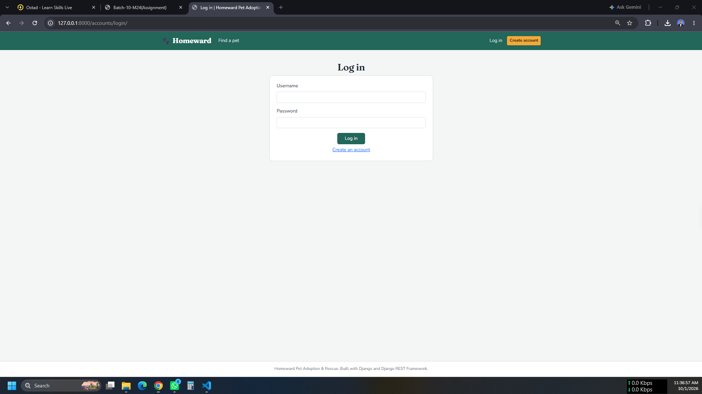

### Sign Up

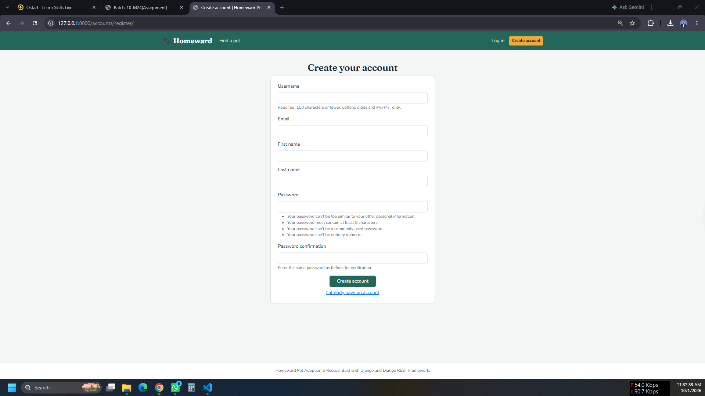

------------------------------------------------------------------------

## 🏠 User Interface

### User Dashboard

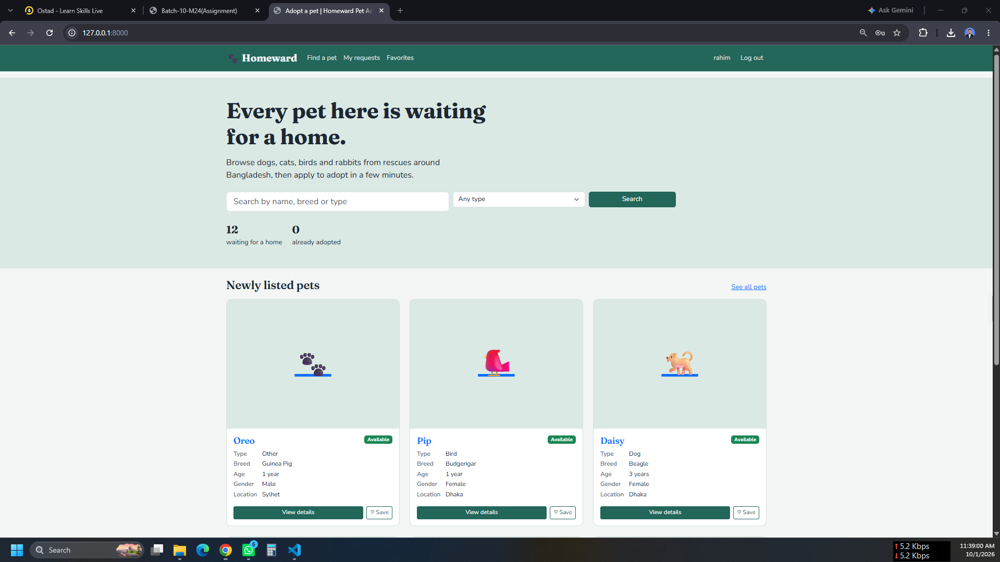

### User Profile

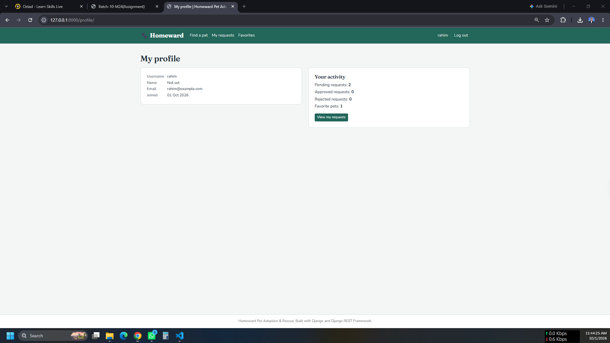

### Find Pet

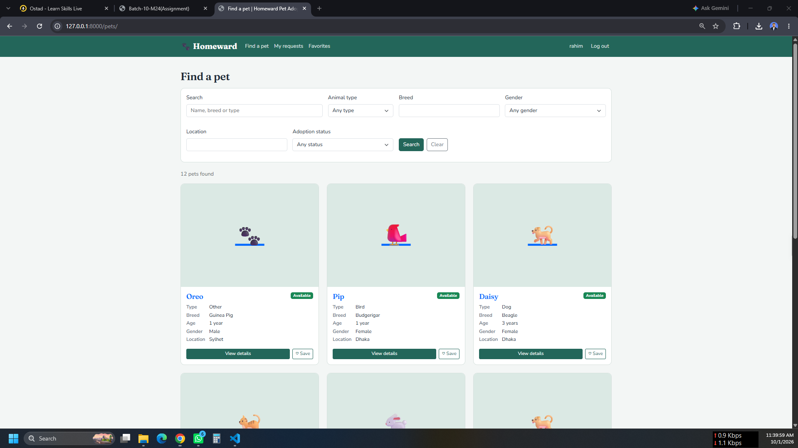

### Pet Description

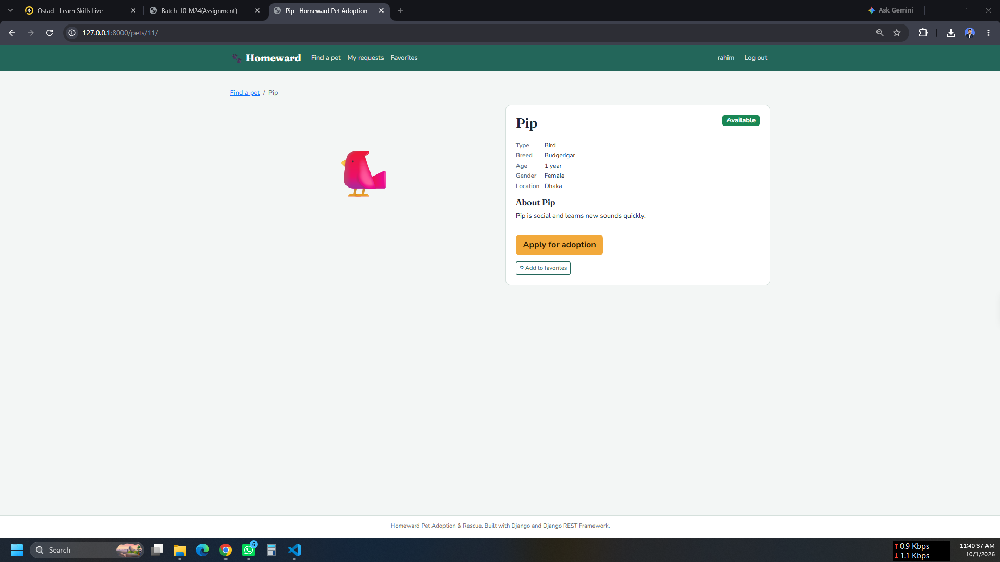

### Favorite Pets

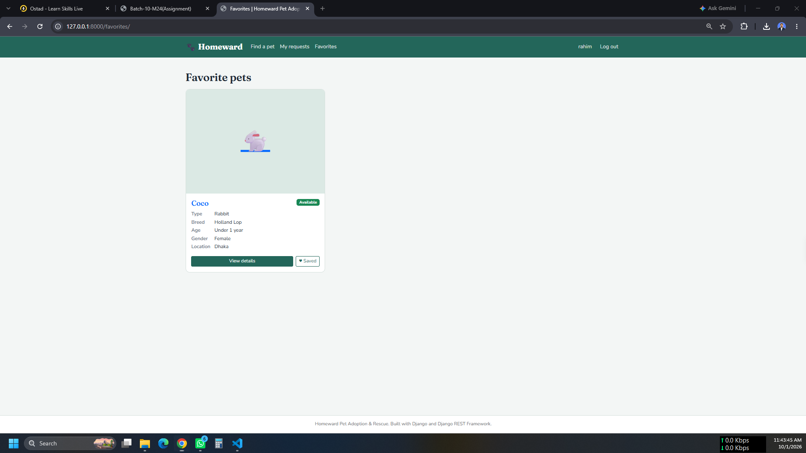

------------------------------------------------------------------------

## 📝 Adoption

### Adoption Application

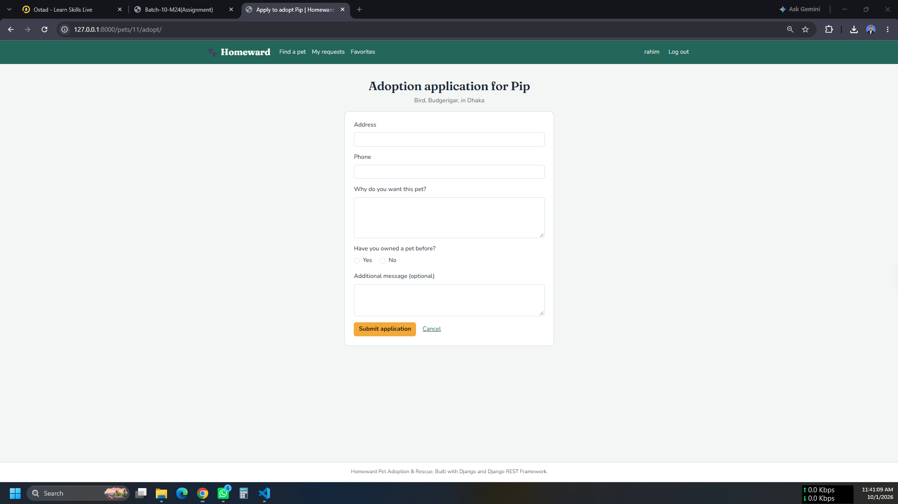

### Adoption Requests

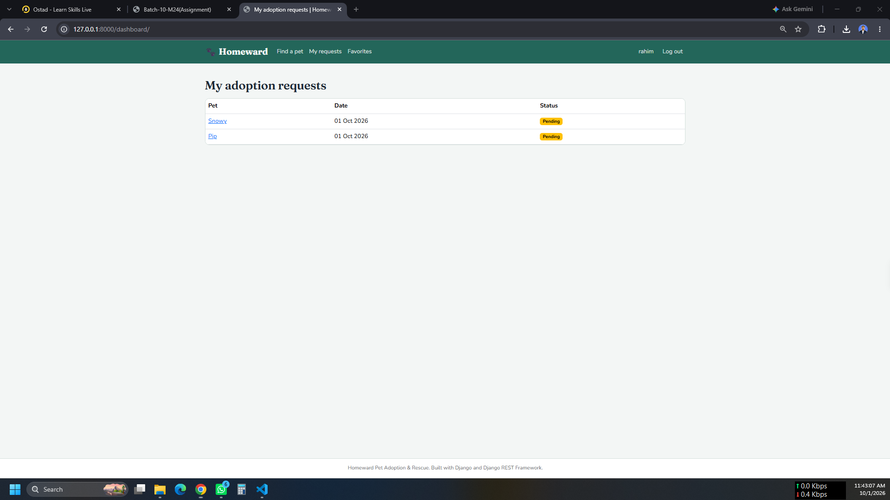

### User Request Approval


### User Request Approval --- Alternative View

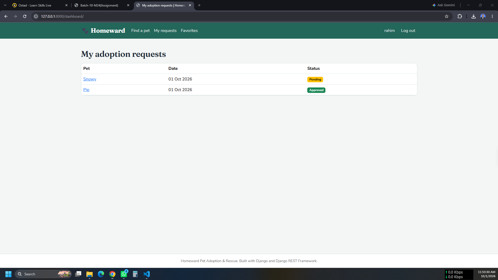

### User Request Approval --- Alternative View 2

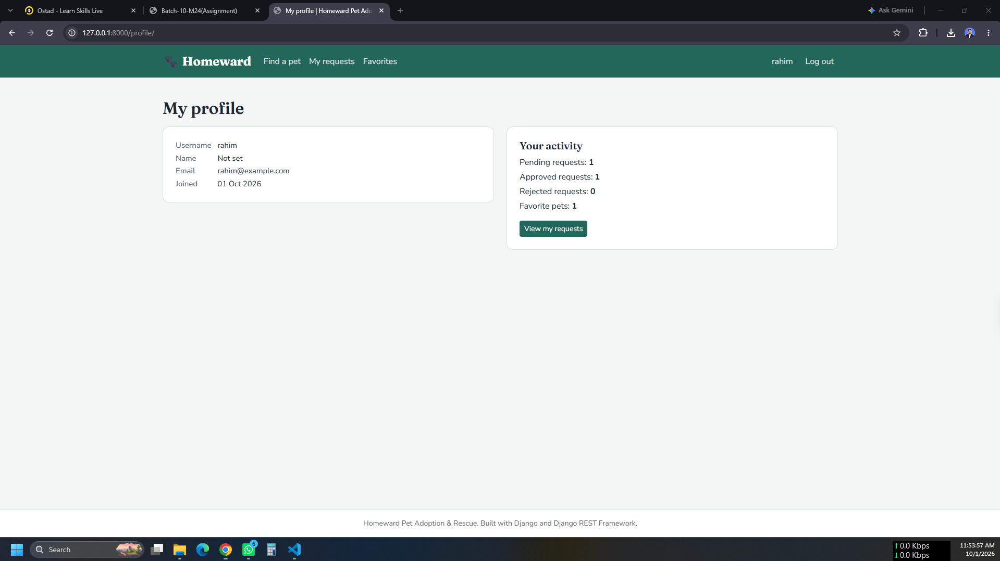

------------------------------------------------------------------------

## 🔧 Admin

### Admin Home


### Admin Adoption Requests

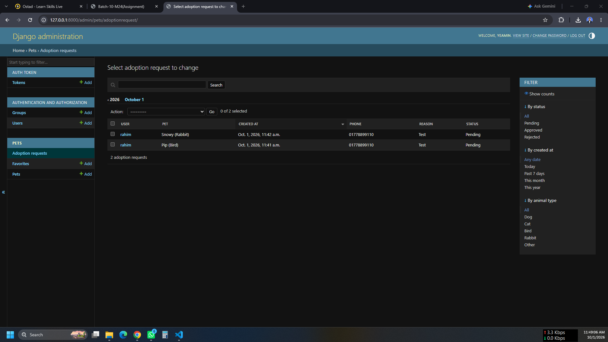

### Admin Approval

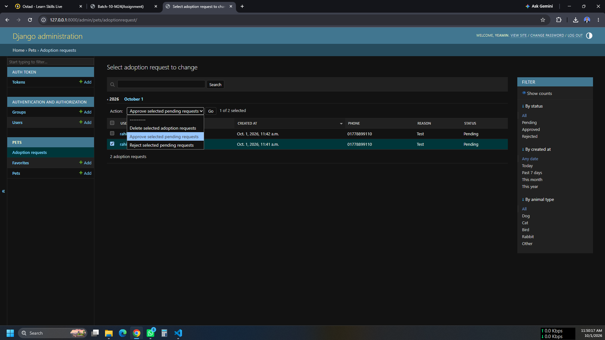

### Admin Approval --- Alternative View

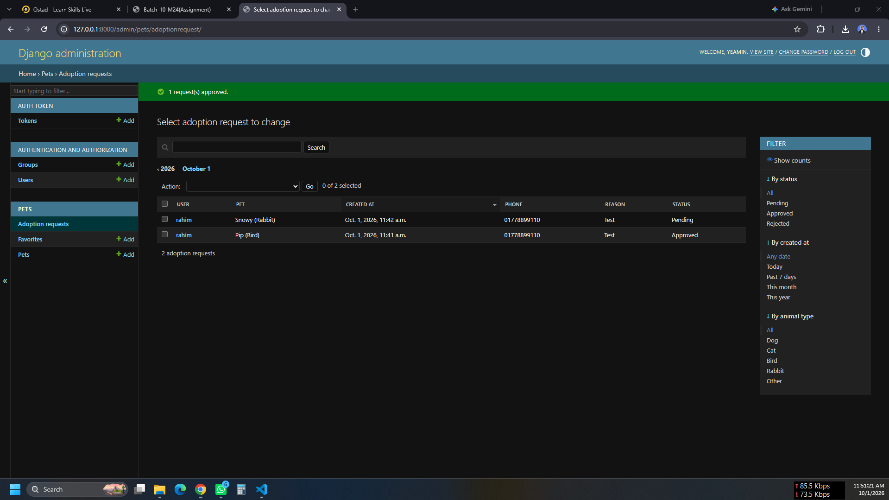

### Site Administration

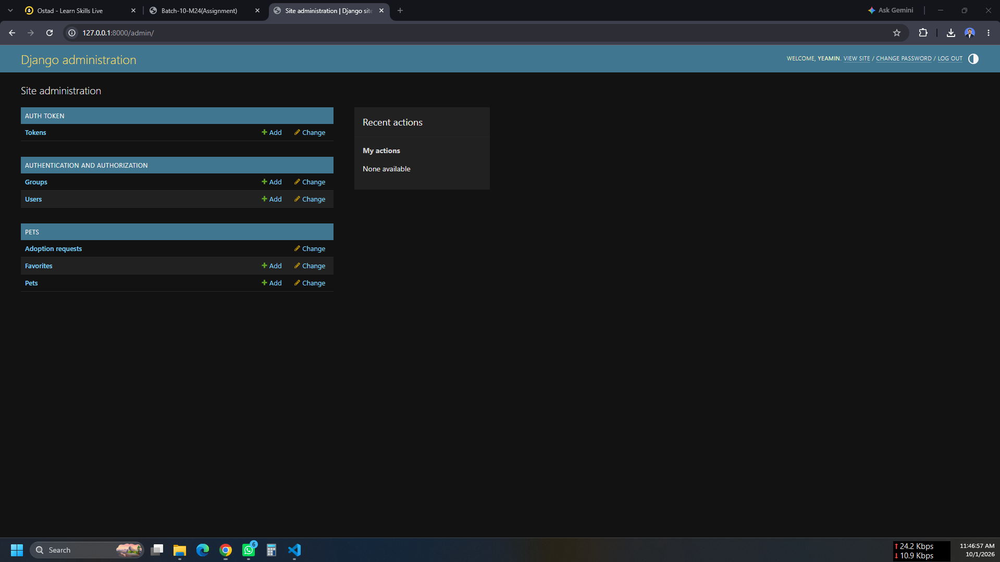

------------------------------------------------------------------------

# 📁 Suggested Project Structure

``` text
Pet_Adoption_&_Rescue_Platform/
│
├── manage.py
├── requirements.txt
├── README.md
│
├── screenshots/
│   ├── admin_adoptionrequests.png
│   ├── admin_approve.png
│   ├── admin_approve1.png
│   ├── admin_home.png
│   ├── adoption_application.png
│   ├── adoption_requests.png
│   ├── favorite_pets.png
│   ├── find_pet.png
│   ├── login.png
│   ├── pet_description.png
│   ├── signup.png
│   ├── site_administration.png
│   ├── user_dashboard.png
│   ├── user_profile.png
│   ├── user_request_approve.png
│   ├── user_request_approve1.png
│   └── user_request_approve2.png
│
├── templates/
│   └── ...
│
├── static/
│   └── ...
│
└── <django_apps>/
    ├── models.py
    ├── views.py
    ├── serializers.py
    ├── urls.py
    └── ...
```

> The exact application/module structure may vary depending on the
> implementation.

------------------------------------------------------------------------

# ⚙️ Installation & Setup

## 1. Clone the Repository

``` bash
https://github.com/yeaminhossainfuhad-cloud/Pet_Adoption_-_Rescue_Platform.git
cd Pet_Adoption_-_Rescue_Platform
```

## 2. Create a Virtual Environment

### Windows

``` bash
python -m venv venv
venv\Scripts\activate
```

### Linux/macOS

``` bash
python3 -m venv venv
source venv/bin/activate
```

## 3. Install Dependencies

``` bash
pip install -r requirements.txt
```

## 4. Apply Migrations

``` bash
python manage.py makemigrations
python manage.py migrate
```

## 5. Create a Superuser

``` bash
python manage.py createsuperuser
```

Follow the prompts to create the admin account.

## 6. Run the Development Server

``` bash
python manage.py runserver
```

Then open:

``` text
http://127.0.0.1:8000/
```

Django Admin:

``` text
http://127.0.0.1:8000/admin/
```

------------------------------------------------------------------------

# 🔑 API Authentication

If API authentication is enabled, authenticated requests should include
the appropriate authentication credentials.

For token authentication, an example request may look like:

``` http
Authorization: Token <your-token>
```

The exact authentication method depends on the project's DRF
configuration.

------------------------------------------------------------------------

# 📦 Requirements

The project is based on:

-   Python
-   Django
-   Django REST Framework
-   SQLite/PostgreSQL or another configured database
-   HTML
-   CSS
-   JavaScript
-   Bootstrap *(if used)*

Install the exact project dependencies from:

``` text
requirements.txt
```

------------------------------------------------------------------------

# ⭐ Bonus Features

Optional features that can be included:

-   ❤️ Favorite pets
-   📄 Pagination
-   🔌 API pagination
-   🔐 API authentication
-   🐶 Pet categories
-   Advanced filtering
-   Improved responsive design

------------------------------------------------------------------------

# 🧪 Example User Flow

``` text
Register
   ↓
Login
   ↓
Browse Pets
   ↓
Search / Filter
   ↓
Open Pet Details
   ↓
Apply for Adoption
   ↓
Application = Pending
   ↓
Admin Reviews Application
   ↓
 ┌───────────────┐
 │               │
Approve        Reject
 │               │
 ↓               ↓
Pet = Adopted   Request = Rejected
```

------------------------------------------------------------------------

# 📋 Submission Checklist

Before submitting the project, make sure the repository contains:

-   [x] Django project
-   [x] User registration/login/logout
-   [x] Pet browsing
-   [x] Pet search and filtering
-   [x] Pet details
-   [x] Adoption application
-   [x] User dashboard
-   [x] Django Admin
-   [x] Adoption approval/rejection
-   [x] Business rules for adoption
-   [x] Django REST Framework APIs
-   [x] `README.md`
-   [x] `requirements.txt`
-   [x] Database migrations
-   [x] Project screenshots

------------------------------------------------------------------------

# 👨‍💻 Author

**YEAMIN HOSSAIN FUHAD**

Pet Adoption & Rescue Platform

------------------------------------------------------------------------

## 📄 License

This project was developed for educational purposes as part of a Django
/ Django REST Framework project assignment.
